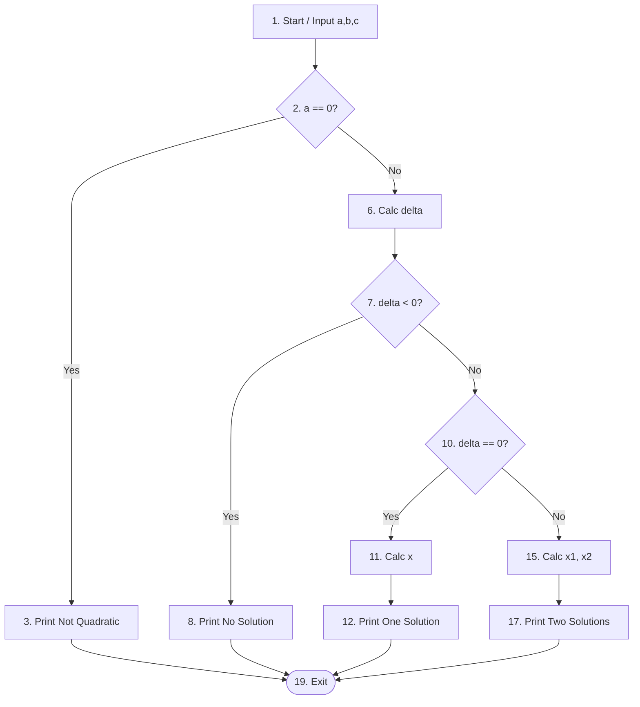

# Kiểm thử Dòng dữ liệu (Data Flow Testing) - Ví dụ Điển hình

Tài liệu này giải thích khái niệm kiểm thử theo **Data Flow Graph (DFG)** thông qua ví dụ điển hình nhất: **Giải phương trình bậc 2**.

## 1. Khái niệm cốt lõi

Trong kiểm thử dòng dữ liệu, chúng ta quan tâm đến vòng đời của các biến (variables) trong chương trình, từ lúc chúng được gán giá trị (Defined) đến lúc chúng được sử dụng (Used).

*   **Definition (def)**: Nơi một biến được gán giá trị (ví dụ: `x = 5`, `input(a)`).
*   **Use (use)**: Nơi giá trị của biến được đọc/sử dụng.
    *   **Computation use (c-use)**: Biến được dùng để tính toán hoặc gán cho biến khác (ví dụ: `y = x + 1`, `print(x)`).
    *   **Predicate use (p-use)**: Biến được dùng trong điều kiện rẽ nhánh (ví dụ: `if (x > 0)`, `while (n < 5)`).
*   **DU-Path (Definition-Use Path)**: Một đường đi từ nơi biến định nghĩa (def) đến nơi nó được sử dụng (use) mà không bị định nghĩa lại ở giữa.

## 2. Chương trình ví dụ: Giải phương trình bậc 2

Đây là ví dụ kinh điển vì nó có đầy đủ nhập liệu, tính toán trung gian (`delta`), điều kiện rẽ nhánh (`if`), và các kết quả khác nhau.

**Mã giả (Pseudocode):**

```java
1.  void solveQuadratic(float a, float b, float c) {
2.      if (a == 0) {
3.          print("Not a quadratic equation");
4.          return;
5.      }
6.      float delta = b*b - 4*a*c;
7.      if (delta < 0) {
8.          print("No real solution");
9.      }
10.     else if (delta == 0) {
11.         float x = -b / (2*a);
12.         print("One solution: " + x);
13.     }
14.     else { // delta > 0
15.         float x1 = (-b - sqrt(delta)) / (2*a);
16.         float x2 = (-b + sqrt(delta)) / (2*a);
17.         print("Two solutions: " + x1 + ", " + x2);
18.     }
19. }
```

## 3. Phân tích Dòng dữ liệu (Data Flow Analysis)

Chúng ta sẽ phân tích các biến chính: `a`, `b`, `c`, `delta`.

### Biểu đồ (CFG) và Vị trí Def/Use



### Bảng Def-Use

| Biến (`v`) | Dòng lịnh nghĩa (Def) | Dòng sử dụng (Use) | Loại Use (Type) |
| :--- | :--- | :--- | :--- |
| **a** | 1 (input) | 2 | p-use (`if a==0`) |
| | | 6 | c-use (`4*a*c`) |
| | | 11 | c-use (`/ (2*a)`) |
| | | 15, 16 | c-use (`/ (2*a)`) |
| **b** | 1 (input) | 6 | c-use (`b*b`) |
| | | 11 | c-use (`-b`) |
| | | 15, 16 | c-use (`-b`) |
| **c** | 1 (input) | 6 | c-use (`4*a*c`) |
| **delta** | 6 (assign) | 7 | p-use (`if delta < 0`) |
| | | 10 | p-use (`if delta == 0`) |
| | | 15, 16 | c-use (`sqrt(delta)`) |

## 4. Các đường kiểm thử (Test Paths)

Để phủ toàn bộ dòng dữ liệu (Coverage Criteria như All-Defs hoặc All-Uses), ta cần các test case đi qua các cặp def-use này.

**Ví dụ phân tích biến `delta` (Định nghĩa tại dòng 6):**

1.  **Cặp Def-Use 1**: Def tại 6 -> Use tại 7 (p-use).
    *   *Test 1*: `a=1, b=1, c=5` -> `delta = -19`. Đường đi: 1-2-6-7 (True). Bao phủ nhánh `delta < 0`.
2.  **Cặp Def-Use 2**: Def tại 6 -> Use tại 10 (p-use).
    *   Phải đi qua 7 (False) để tới 10.
    *   *Test 2*: `a=1, b=2, c=1` -> `delta = 0`. Đường đi: 1-2-6-7-10 (True). Bao phủ nhánh `delta == 0`.
3.  **Cặp Def-Use 3**: Def tại 6 -> Use tại 15, 16 (c-use).
    *   Phải đi qua 7 (False) và 10 (False).
    *   *Test 3*: `a=1, b=4, c=1` -> `delta = 12`. Đường đi: 1-2-6-7-10-15-16. Bao phủ nhánh `delta > 0`.

**Kết luận:**
Với 3 test case trên, ta đã kiểm tra được việc tính toán `delta` SAI hay ĐÚNG ảnh hưởng thế nào đến cả 3 trường hợp sử dụng sau đó. Đây chính là sức mạnh của kiểm thử dòng dữ liệu: tập trung vào sự lan truyền giá trị của biến.
