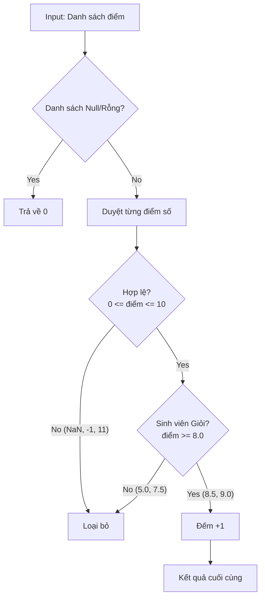

# Báo cáo Chiến lược Kiểm thử & Độ bao phủ (Testing Report)

Tài liệu này phân tích chi tiết các kỹ thuật kiểm thử phần mềm đã được áp dụng trong dự án `StudentAnalyzer`, giải thích các khái niệm lý thuyết và ánh xạ vào thực tế code.

## 1. Các Kỹ thuật Kiểm thử Đã Sử dụng

Dự án áp dụng 3 kỹ thuật kiểm thử hộp đen (Black-box testing) kinh điển. Dưới đây là giải thích chi tiết:

### 1.1. Phân hoạch tương đương (Equivalence Partitioning - EP)
**Khái niệm:**  
Là kỹ thuật chia dữ liệu đầu vào thành các "miền" (partitions) tương đương nhau. Nếu một giá trị trong miền hoạt động đúng, ta giả định tất cả các giá trị cùng miền đó cũng hoạt động đúng. Giúp giảm số lượng test case cần thiết.

**Áp dụng trong bài:**
Trong `StudentAnalyzerTest`, chúng ta đã chia input *điểm số* thành 3 miền:
1.  **Miền hợp lệ (Valid)**: `0.0 <= điểm <= 10.0`
    *   *Code:* `testValidScores()` (Test với 5.0, 8.5)
2.  **Miền không hợp lệ (Invalid)**: `điểm < 0`, `điểm > 10`, hoặc `NaN`.
    *   *Code:* `testInvalidScores()` (Test với -1.0, 11.0, NaN)
3.  **Miền rỗng/null (Empty/Null)**: Danh sách không có phần tử nào.
    *   *Code:* `testNullOrEmpty()`

### 1.2. Phân tích giá trị biên (Boundary Value Analysis - BVA)
**Khái niệm:**  
Tập trung kiểm thử tại các giá trị "rìa" (biên) của các miền EP, vì lỗi thường xuất hiện ngay tại điểm chuyển giao giữa đúng và sai. Thường test tại: Giá trị biên (Min, Max) và cận biên (Min-1, Max+1).

**Áp dụng trong bài:**
Chúng ta có 2 loại biên cần kiểm tra:
1.  **Biên của miền giá trị điểm (0 - 10)**:
    *   Biên dưới: `-0.01` (Invalid) và `0.0` (Valid).
    *   Biên trên: `10.0` (Valid) và `10.01` (Invalid).
    *   *Code:* `testScoreBoundaries()`
2.  **Biên của logic nghiệp vụ (Sinh viên giỏi >= 8.0)**:
    *   Cận kề: `7.99` (Không đạt).
    *   Tại biên: `8.0` (Đạt).
    *   *Code:* `testExcellentThresholdBoundaries()`

### 1.3. Bảng quyết định (Decision Table Testing)
**Khái niệm:**  
Dùng cho các logic phức tạp có sự kết hợp của nhiều điều kiện (AND/OR). Ta liệt kê mọi tổ hợp điều kiện (Rule) và hành động tương ứng để đảm bảo không bỏ sót trường hợp logic nào.

**Áp dụng trong bài:**
Logic của hàm `countExcellentStudents` có 2 điều kiện kết hợp:
*   Điều kiện 1: Điểm hợp lệ? (Valid Score)
*   Điều kiện 2: Điểm >= 8.0? (Excellent)

| Rule | Input (Điểm) | Điều kiện 1 (Valid) | Điều kiện 2 (>= 8.0) | Hành động (Đếm) | Code Test |
| :--- | :--- | :---: | :---: | :---: | :--- |
| 1 | NaN / 11.0 | False | - | Không | `testDecisionTableRules` |
| 2 | 5.0 | True | False | Không | `testDecisionTableRules` |
| 3 | 9.0 | True | True | Có | `testDecisionTableRules` |

## 2. Độ Bao Phủ Mã Nguồn (Code Coverage)

**Khái niệm:**  
Là thước đo phần trăm mã nguồn của chương trình đã được thực thi khi chạy các test case.
*   **Statement Coverage**: Số dòng lệnh đã được chạy.
*   **Branch Coverage (Decision Coverage)**: Số nhánh `if/else`, `loop` đã được đi qua (cả nhánh True và False).

**Đánh giá trên bài này:**
Dựa trên bộ test `StudentAnalyzerTest`, chúng ta đạt được độ bao phủ rất cao (gần như 100%):

1.  **Valid Score Check (`isValidScore`)**:
    *   Đã test `null` -> Covers nhánh `score != null`.
    *   Đã test `NaN/Infinity` -> Covers nhánh `Double.isFinite`.
    *   Đã test `<0`, `>10` -> Covers nhánh `score >= 0` và `score <= 10`.
2.  **Main Logic (`countExcellentStudents`)**:
    *   Đã test input `null/empty` -> Covers nhánh `if (scores == null || scores.isEmpty())`.
    *   Đã test luồng chính -> Covers stream filter.
    *   Đã test filter 8.0 -> Covers `s >= 8.0`.

=> **Kết luận**: Bộ test này an toàn và bao phủ gần như toàn bộ logic.

## 3. Luồng Dữ Liệu (Data Flow)

Dưới đây là sơ đồ luồng đi của một điểm số qua hàm xử lý:

